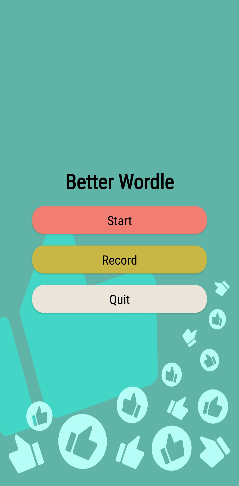
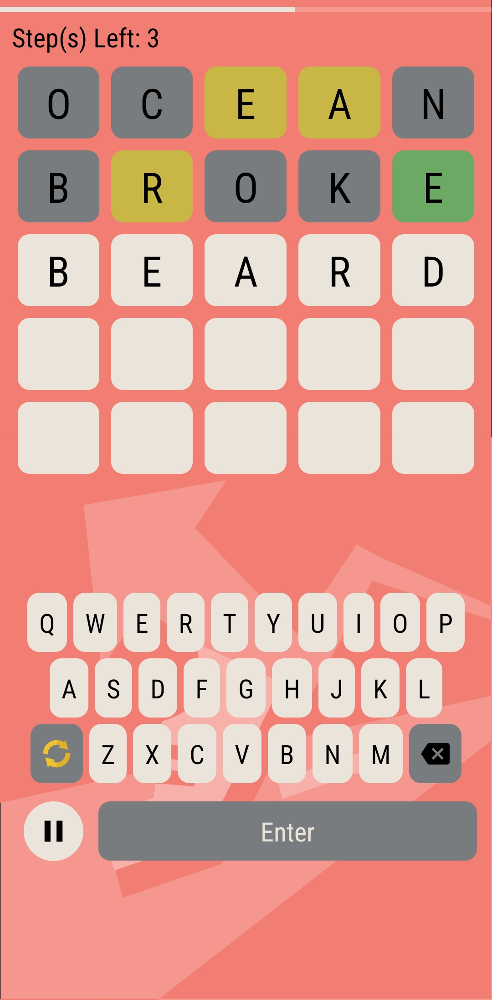
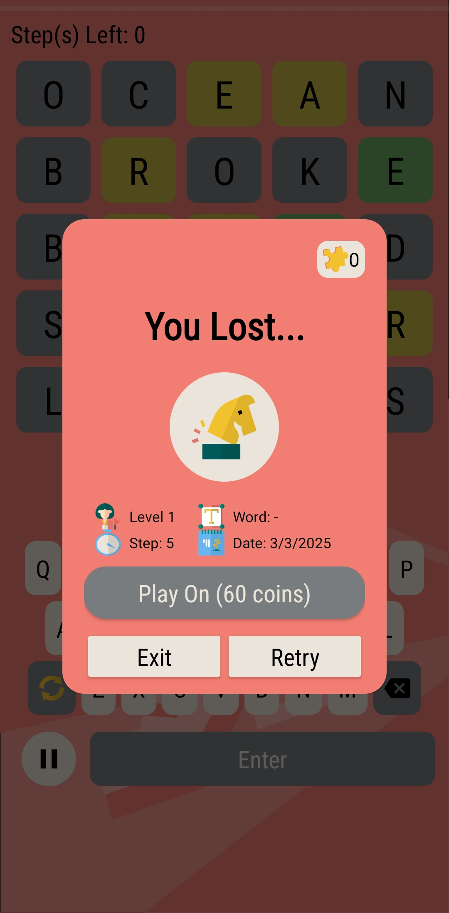
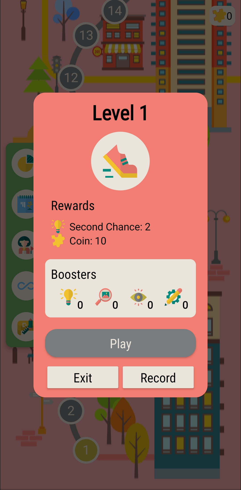
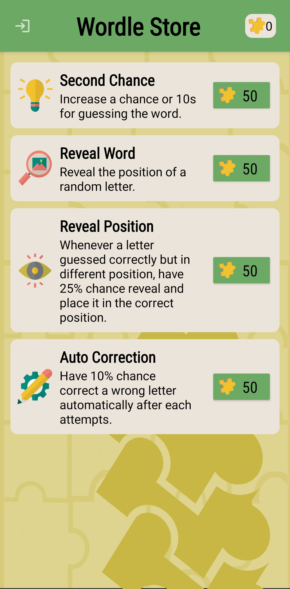
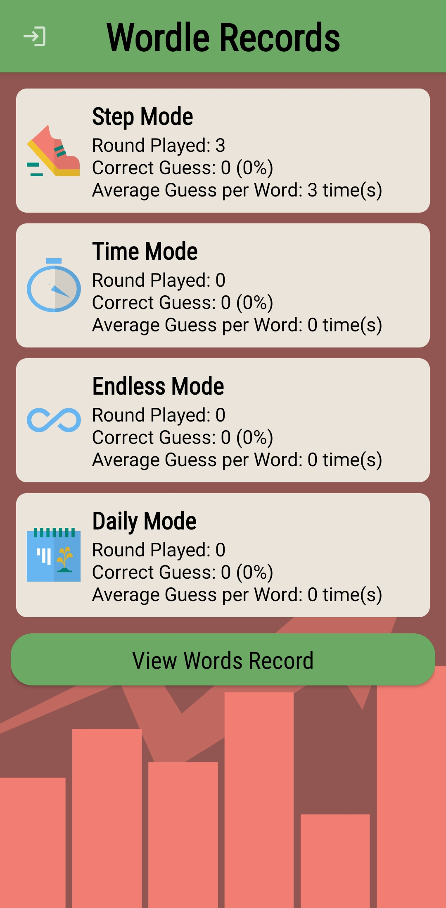
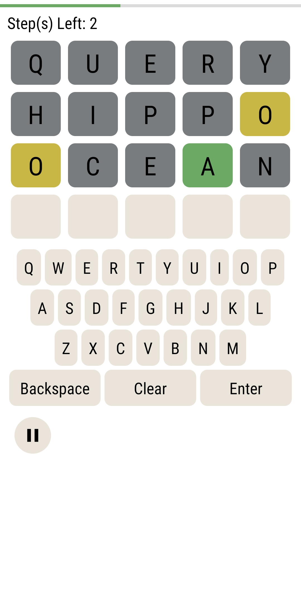
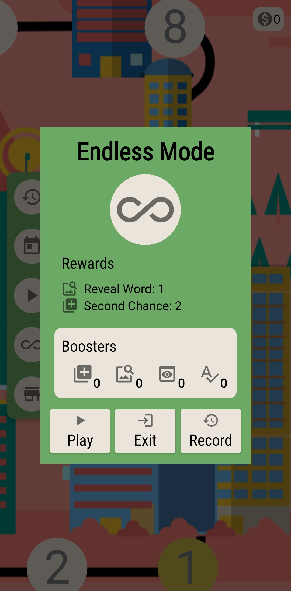

# Wordle Android Game

An app clone of Wordle (Spelling Game) using Android Studio, 
with extra feature including endless playing mode, timed mode, 
journey mode, boosters and words definition checking.
All UI resources are self-made. 
Currently, only only a couple of level is designed that is forever looping in journey mode.

## Technology Used

- Platform: Android Studio
- Programming Language: Java

# Demo

## App Installation

Download [wordle](wordle.apk) and install on Android device with version above 7.0 (Android 13 recommended). 

## Gallery

| Description           | Image                                                     | Description           | Image                                                        |
|-----------------------|-----------------------------------------------------------|-----------------------|--------------------------------------------------------------|
| Current Start Screen  |     | Current Map Screen    |      |
| Current Game Screen   |       | Current Result Dialog |      |
| Current Level Dialog  |      | Current Store Screen  |        |
| Current Stat Screen   |      | Current Record Screen |  |
| Previous Map Screen   |  | Previous Game Screen  |         |
| Previous Store Screen |    | Previous Level Dialog |        |

